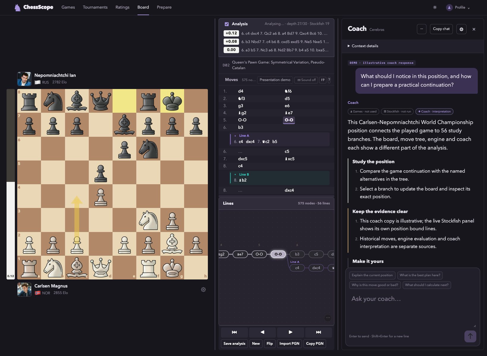
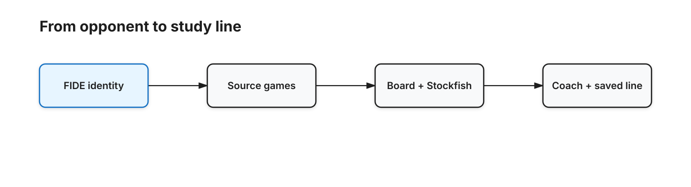
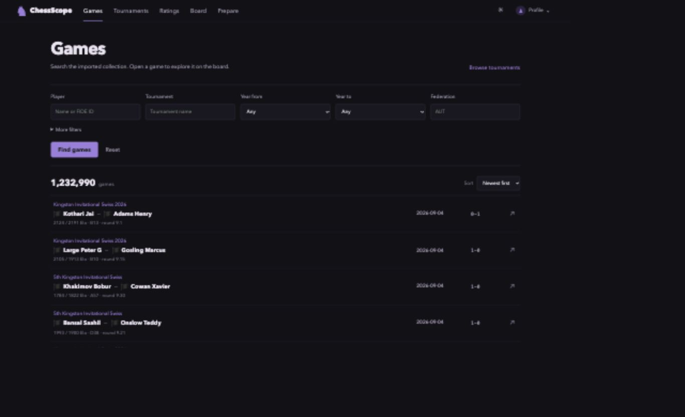
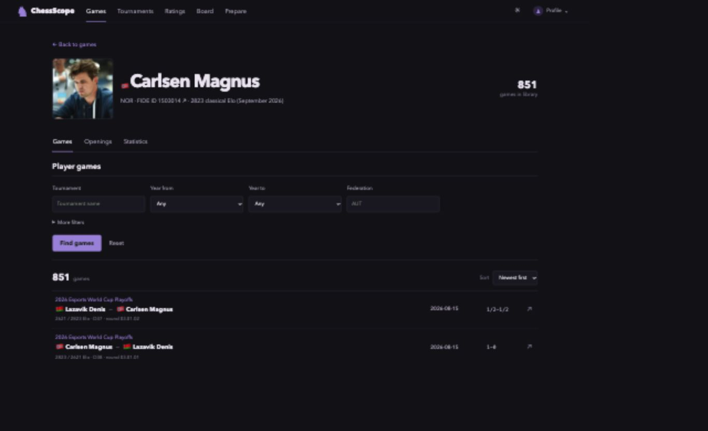
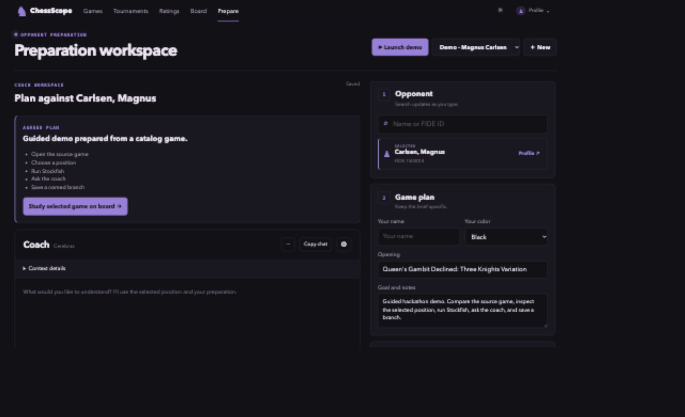
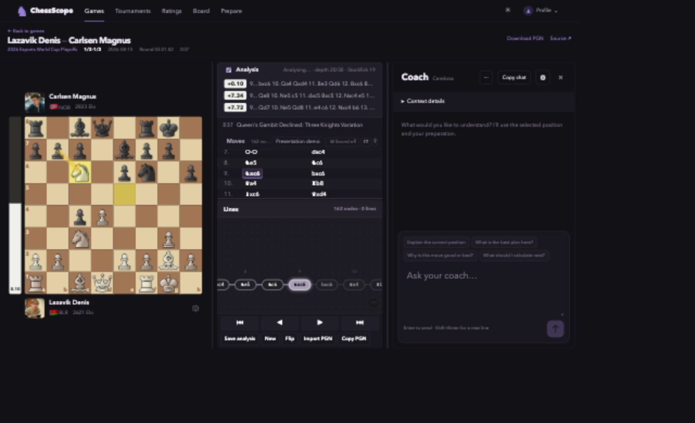
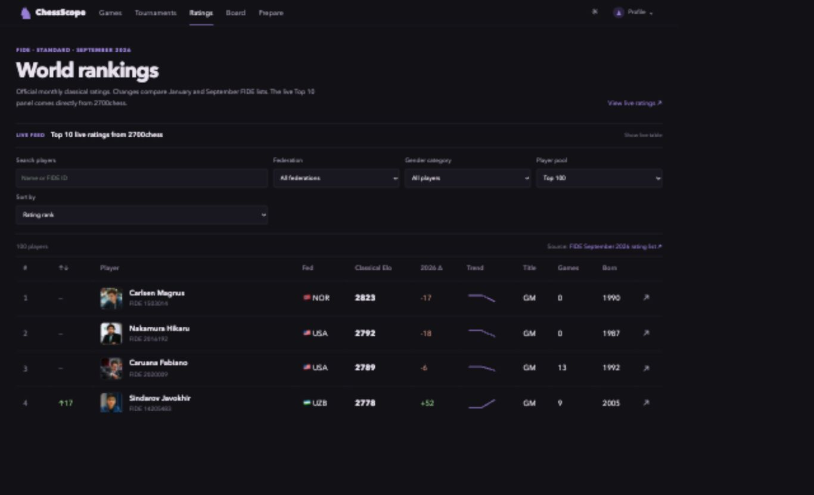
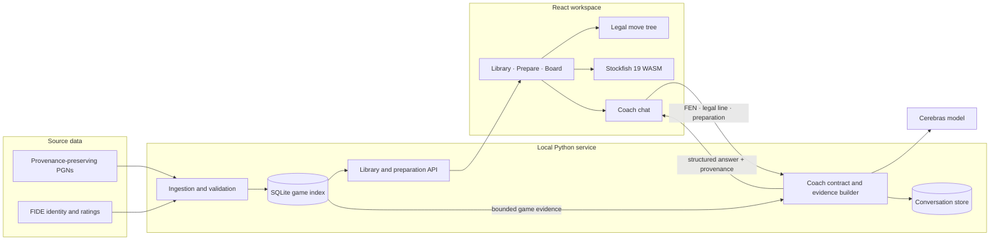

# ChessScope

### Prepare for an opponent. Study the evidence. Keep the line.

**HACK_002 Vienna · Chess research and analysis prototype**

ChessScope connects a FIDE player identity, indexed games, an analysis board, browser-based Stockfish and a position-aware coach. The player can trace a claim back to a game, inspect an engine line and save a chosen variation.



*Full analysis workspace. The visible coach answer is labeled illustrative demo copy; the board, imported PGN tree and engine are real application features.*

[Product tour](#product-tour) · [System design](#system-design) · [Run locally](#run-locally)

## At a glance

| Observed in the local prototype | Scope |
| --- | ---: |
| Indexed games shown in the library | 1,232,990 |
| Games associated with Magnus Carlsen in the inspected index | 851 |
| Bundled showcase PGN | 575 nodes · 56 variations |
| Browser engine | Stockfish 19 |

The index is a sourced local sample, not a complete official game record. Game eligibility and exclusions are reported separately in preparation evidence.

## The problem

Before a round, a player may need to identify the right opponent, find useful games, inspect a position and decide what to study. Those actions are usually split across a database, board, engine and chat. ChessScope keeps the source game and selected position in the same workflow as the explanation.



[Edit the study-flow diagram](./assets/study-flow.excalidraw)

## Product tour

### 1. Find a real game

The library searches imported games by player, tournament, date and other filters. A result opens its source PGN on the board.



### 2. Check the player record

A player page ties the name to a FIDE ID and shows the games available in this index. The displayed count describes local coverage, not every game the player has played.



### 3. Build an opponent brief

Preparation stores the selected player, color, opening, goal and linked coach conversation. The guided demo below uses a catalog game and names the steps still to study.



### 4. Analyze the source position

The game page keeps source metadata, board, moves, tree, engine and coach together. Selecting a move updates the position; Stockfish evaluates that FEN in the browser.



### 5. Explore and save alternatives

The full workspace shown at the top imports a 2021 Carlsen–Nepomniachtchi study with 56 variations. The move list and graph share one legal tree. A proposed line is replayed before it can become a saved branch; the user chooses whether to apply it.

### 6. Put ratings in context

The Rankings view uses the September 2026 official FIDE monthly snapshot. Its change and trend columns compare stored monthly data; the separate live Top 10 feed is attributed to 2700chess.



## System design



**Boundaries that matter:** the catalog supplies historical records; `chess.js` and `python-chess` check move legality; Stockfish supplies position analysis; the model explains supplied context. The server checks the move sequence and selected FEN before sending a coach request. The chat stores a context snapshot with each turn. A model response does not silently change the tree.

## Implementation

| Layer | In this repository |
| --- | --- |
| Interface | React 19, TypeScript, Vite |
| Board and variations | `chess.js`, persistent legal move tree |
| Engine | Stockfish 19 WebAssembly in the browser |
| Service | Python HTTP server, `python-chess` |
| Evidence and history | SQLite game index and separate coach store |
| Coach | Structured context and Cerebras provider adapter |

The showcase coach answer is synthetic and marked **“DEMO · illustrative coach response”** in the app. It demonstrates layout only. A live answer requires a configured provider, and the screenshot makes no claim that its text was generated for the visible position.

## Run locally

The library requires local `data/corpus.sqlite` and `data/library.sqlite` files.

```bash
python3 -m venv .venv
.venv/bin/pip install -r requirements-ingestion.txt
cd frontend && npm ci && npm run build && cd ..
.venv/bin/python -m library serve --corpus data/corpus.sqlite --library data/library.sqlite --port 8765
```

Open `http://localhost:8765`. **Presentation demo** loads the multi-variation board scene. For live coach replies, set `CEREBRAS_API_KEY` in the environment or ignored `.env.local`; `CEREBRAS_MODEL` is optional.

## Evidence and limits

The screenshots were captured from the locally running application. The source-game page is a catalog record; the full workspace uses a bundled [Lichess study PGN](https://lichess.org/study/RoBvWqfx/0IsLRqJa). The prototype was built and its prior frontend verification recorded 26 passing checks. The local index includes quarantined and rejected records, so preparation reports usable samples and exclusions rather than presenting the raw catalog count as a complete repertoire.

Detailed notes: [ingestion](docs/09-database-parsing.md) · [game library](docs/10-game-library.md) · [coach architecture](docs/12-ai-coach-architecture.md) · [preparation plan](docs/13-preparation-redesign-plan.md) · [hackathon wins](docs/14-high-impact-hackathon-wins.md).
