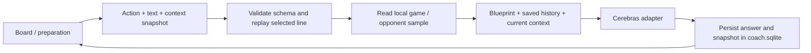

# Contextual AI coach

The board and preparation page use the same coach pipeline. The provider remains
Cerebras; credentials live only in the ignored `.env.local` on the server.



## Code map

| Path | Responsibility |
| --- | --- |
| `library/coach/contracts.py` | Versioned request validation, field whitelist, legal move replay, current engine context |
| `library/coach/context.py` | Read-only evidence from the game library, provenance and sample limitations |
| `library/coach/blueprints.py` | Allowed actions, labels, requirements, version |
| `library/coach/blueprints/*.md` | Shared guidelines and an editable prompt per action |
| `library/coach/prompts.py` | System prompt, previous turns with position anchors, current request |
| `library/coach/provider.py` | Cerebras HTTP, server credentials, TLS, timeout, provider errors |
| `library/coach/store.py` | Local SQLite history, immutable snapshots, deduplication |
| `library/coach/service.py` | Orchestration, request fingerprint, generation serialization |
| `frontend/src/ai/` | Browser contracts, context collection, explicit preparation handoff, API calls |
| `frontend/src/components/ChatPanel.tsx` | Shared chat, actions, context disclosure, history and retry |

`library/server.py` only routes HTTP to the service. Existing corpus/library
databases remain read-only. Conversations use `data/coach.sqlite` beside the
configured library file and survive server restarts.

## Current actions

- `ask`: user text is required.
- `explain_position`: requires a board; optional user instructions.
- `preparation_plan`: requires preparation; optional user instructions.
- `repertoire`: requires a selected opponent; a FIDE ID enables library evidence.

Clients send an action ID, never a custom system prompt. To add an action, add its
Markdown file and registry entry; the frontend loads the registry. Increment the
blueprint version when changing prompt behavior. Extend `contracts.py` and
`frontend/src/ai/types.ts` together when adding context fields. Action requirements
currently support `board`, `preparation`, and `opponent`.

## HTTP contract (v1)

`GET /api/ai/actions` returns `{actions: [...]}`.

`GET /api/ai/history?conversationId=...` returns `{turns: [...]}` in chronological
order (most recent 100). All completed turns remain stored; the last six are sent
to the model, with the board/preparation anchor of each old turn.

`GET /api/ai/preparations` returns saved preparation drafts; `POST` accepts
`{studies: [{id, title, project, updated, preparation}]}` and upserts by ID and
timestamp. Drafts are validated through the same preparation contract as chat.
`GET /api/ai/active-preparation` returns `{preparation}`; `POST` stores the explicit
handoff snapshot, or `{preparation: null}` to detach it.

`POST /api/ai/chat`:

```json
{
  "version": 1,
  "conversationId": "prep:my-study",
  "requestId": "unique-request-id",
  "action": "preparation_plan",
  "message": "How should I study the c-file?",
  "context": {
    "preparation": {
      "id": "my-study",
      "project": "Next match",
      "player": {"name": "Preparing player"},
      "opponent": {"name": "Opponent"},
      "color": "white",
      "opening": "London System",
      "notes": "Focus on typical middlegames."
    }
  }
}
```

Board requests also carry `boardSource`, optional `gameId`, and `board` containing
`rootFen`, `fen`, `nodeId`, a UCI `line`, the opening lookup, and available engine
lines. The server replays the line to the selected FEN, generates SAN, and checks
the legality of supplied engine variations. An engine result for another FEN is
discarded. Evaluations are explicitly from White's perspective and labelled as
browser Stockfish output, not a server engine run.

Response: `{turn: {id, conversationId, action, blueprintVersion, message, reply,
model, createdAt, context}}`. The returned context contains the validated request
plus server evidence, and is the same snapshot stored with the answer. Errors
return `{error}` with an appropriate HTTP status. The bundled frontend uses v1.
The previous `/api/chat` prototype route remains as a compatibility adapter for
already-open pages: `{message, fen}` returns `{reply, model}` through the same
validated pipeline. Legacy requests contain no player or game identity, so each
is an isolated turn with only the supplied position. Reload to use contextual v1
conversations. The composer supports Enter to send and Shift+Enter for newlines;
IME composition confirmation does not submit a message.

## Preparation, evidence and conversation identity

1. In Prepare, search a player and choose **Use as opponent**. An explicit choice
   binds their FIDE ID; a typed name alone remains a user note.
2. Set the preparing player, color, planned opening and repertoire/goal notes.
3. Chat on the preparation page or choose **Open board with this preparation**.
   Both screens use `prep:<study id>` and share saved AI history.
4. The board shows the attached preparation and allows detaching it. Each send
   uses the current node/line; previous answers keep their original snapshot.

Preparation drafts and the active handoff snapshot are saved in `coach.sqlite`.
The browser retains the existing local studies cache when storage is available;
previous local drafts are merged with saved drafts and uploaded when edited or
selected. Saving the preparation and handoff completes before opening the board.
Editing a preparation later requires another handoff to update the board
attachment. Every sent snapshot is also persisted with its answer. Old
library-search messages remain browser-local and are not AI conversation history.

Without preparation, library games use `game:<id>`. Standalone analysis uses a
tab-local ID; New/import starts another ID. Demo context has its own identity and
never masquerades as a library game. The board itself is not persisted by this
module. Reopening a conversation does not restore its old board automatically.

Opponent evidence uses up to 200 recent **accepted** games per color, with date
ranges, the eight most frequent opening labels, sample counts, and example game
links. These are PGN-derived labels, not independently verified opening skill.
Opening intention, actual board lookup, historical game metadata and opponent
evidence stay distinct. No assumption about a player's London System expertise
is hard-coded.

## Reliability and limits

- Each request snapshots context before sending; retry reuses that request ID
  and snapshot even if the user moves the board.
- Repeated completed IDs return the saved answer. Reusing an ID with different
  content returns 409. Failed provider calls do not append incomplete turns.
- Generation is serialized for this local single-user server; concurrent calls
  receive 409 and can retry. Pending requests are remembered in session storage.
- History/action loads are cancelled on unmount, and late answers cannot populate
  another conversation. Interrupted UI requests can be recovered with retry.
- Input is bounded (64 KB JSON, 4,000-character question, 600-ply selected line).
- Imported/user/library text is untrusted data in the prompt. Credentials never
  enter browser requests or persisted turn data. Provider error bodies are not
  echoed into UI/logs.
- Model output is a validated structured explanation. Moves and scores are supplied
  separately from the browser Stockfish snapshot. A user click can add those
  engine lines after another legality check; no automatic moves or model-generated
  move sequences are applied. There is no server engine invocation, retrieval
  beyond the local sample, or structured repertoire import yet.
- This remains a loopback-only single-user application, with no authentication or
  multi-user access controls. The local history database contains user prompts.

## Running

Keep `CEREBRAS_API_KEY` and optionally `CEREBRAS_MODEL` in the repository's ignored
`.env.local` (or server environment). The default model is `gpt-oss-120b`.

```sh
npm run build --prefix frontend
.venv/bin/python -m library serve --corpus data/corpus.sqlite --library data/library.sqlite --port 8765
```

The server loads `.env.local` relative to the repository, creates the coach database
automatically, and serves the built frontend. Prompt files are read for each new
request; registry or Python changes require a server restart.

## Chat presentation and debugging

The chat composer sends the `ask` action directly; the action selector is not
shown. Other blueprints remain registered for future purpose-specific buttons.
Assistant responses use react-markdown with GFM (headings, lists, emphasis, tables,
and code); raw HTML and remote images are not rendered.

On localhost or a Vite development build, **Copy chat** exports every saved turn
through `GET /api/ai/export?conversationId=...`, including original Markdown,
model/action/version, immutable context, and any pending message or draft. This
export is not restricted to the last 100 turns shown in the UI. Production hosts
do not show the debugging button.

## Engine variations and structured explanations (blueprint v2)

`library/coach/analysis.py` builds canonical numbered SAN variations from the
validated browser Stockfish UCI snapshot. Each variation has an ID (`pv1`–`pv3`),
rank, exact source FEN, depth, White-perspective score, UCI moves and display
notation. The model cannot create or replace these fields. Browser analysis is
not cryptographically attested or rerun on the server; these are finite-depth
results from the application's Stockfish worker, not a guarantee of perfect play.

Cerebras JSON mode returns a summary, typed sections (White plan, Black plan,
advantages, risks, next steps, or general answer), and explanatory text keyed by
existing variation IDs. The server validates the format and rejects unknown IDs.
An invalid model response is not saved as a completed turn. The UI renders this
structure as short numbered lists and places each explanation beside its engine
card. Explanations are AI interpretations; exact moves, rankings and evaluations
are engine-owned. No engine snapshot means no actionable move cards.

Responses add `analysis`, `positionFacts` and `engineLines` alongside the compatible
Markdown `reply`. Position facts and material counts come from python-chess. The
client normalizes invisible/nonbreaking spaces and hides raw inline FEN from
readable prose; the original text remains available in debugging exports. Old
turns receive cards only from their saved engine snapshot and are labelled as
earlier AI explanations: their prose is not retroactively treated as verified.

`frontend/src/chess/chatLines.ts` resolves the original root and UCI ancestry,
checks FEN and every proposed move, then atomically adds the full variation.
Missing/deleted anchors or another library game produce an explicit error.
Existing matching moves are reused, alternatives branch without changing the
main continuation, and repeated clicks do not duplicate nodes. The board shows
the final move and opens the tree. Added nodes retain turn ID, variation ID,
source FEN and depth in `chatSources`; tree and move-list badges identify Chat
provenance. The workspace tree is still in-memory and is not persisted with the
conversation; after resetting it, missing ancestral moves must be restored.
